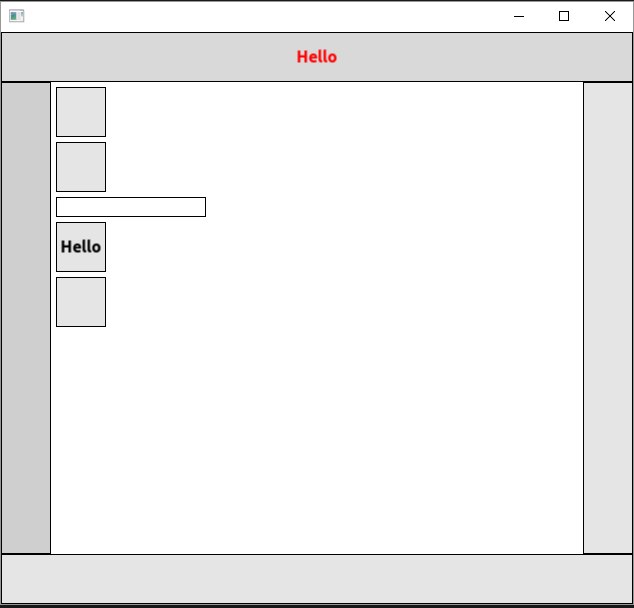
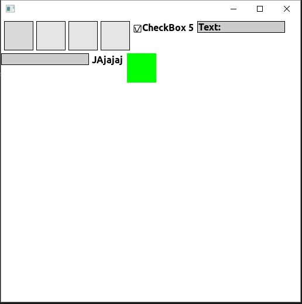
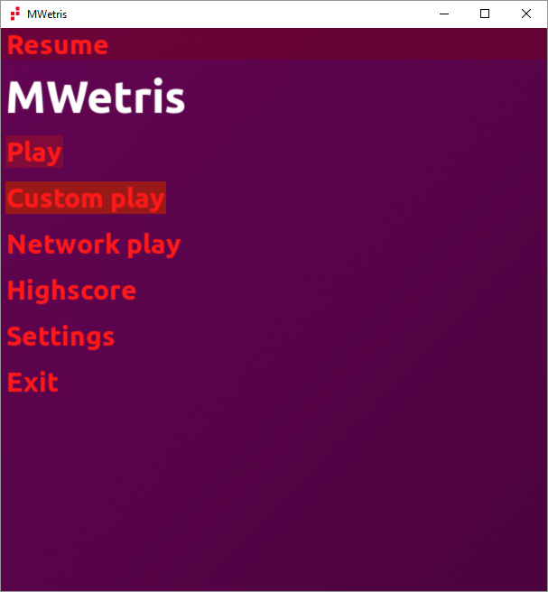

SdlGui
======
Is a simple graphic user interface api. Strongly inspired from java.

External libraries SDL2 (http://www.libsdl.org/), SDL2_image, 
SDL2_ttf, SDL2_mixer and glew.

Open source
======
Is licensed under the MIT License (see LICENSE.txt).

Building
======
CMake must be installed, at least version 3.0. Either use cmake graphical interface, or use the commandline.

Inside the project folder, e.g.
```bash
mkdir build
cd build
# Creates the build for the library and the test code.
cmake -D SdlGuiTest=1 ..
# Run the tests.
./SdlGuiTest
```

Example
======
Three examples of the usage of this library. The two first is contained in test code in this project.

The third is an example from a tetris clone game.




